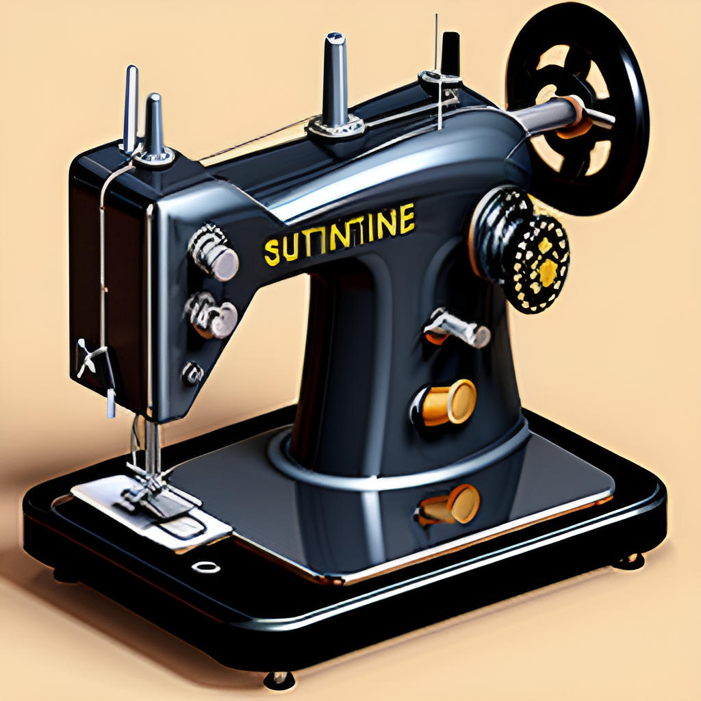

# Understanding Your Sewing Machine

Understanding the basic parts and setup of your sewing machine is essential for getting started. Modern sewing machines may seem complicated at first, but they share common elements that are easy to learn and operate.

## Key Components of a Modern Sewing Machine:
1. **Needle:** The needle delivers the thread through the fabric to create stitches. Different types of needles are used depending on the fabric and thread.
2. **Bobbin:** This small spool holds the lower thread in the machine. It works with the needle to form stitches on the underside of the fabric.
3. **Presser Foot:** Holds the fabric in place while sewing. There are different presser feet for various sewing needs, such as zipper feet and buttonhole feet.
4. **Feed Dogs:** These are the teeth under the presser foot that move the fabric through the machine as you sew.
5. **Stitch Selector:** Allows you to choose the type of stitch you want to use, such as straight, zigzag, or decorative stitches.
6. **Speed Control:** Controls how fast or slow the machine sews. This can be particularly useful for beginners.

## Setting Up Your Sewing Machine:
- **Step 1: Threading the Machine** - Start by placing the spool of thread on the spool pin. Follow the numbered guide printed on your machine to route the thread through various guides and tension mechanisms, down to the needle.
- **Step 2: Inserting and Threading the Bobbin** - Place the wound bobbin in the bobbin case. Thread the tail of the bobbin thread through the slot and under the tension spring.
- **Step 3: Drawing Up the Bobbin Thread** - Hold the end of the needle thread, turn the handwheel towards you to lower and then raise the needle. Pull on the needle thread to bring up the bobbin thread.
- **Step 4: Selecting a Stitch** - Use the stitch selector to choose the type of stitch you want to use, adjusting stitch length and width as necessary.
- **Step 5: Testing the Setup** - Always test your threading and stitch settings on a scrap piece of fabric before beginning your project to ensure everything is set correctly.

## Tips for Maintenance:
- Regularly clean the lint from under the needle plate and in the bobbin area.
- Use a drop of sewing machine oil on the moving parts, as specified in your machine’s manual.
- Replace needles frequently to ensure clean stitches.

This section provides a solid foundation for beginning to sew with your machine, ensuring that you are prepared for simple projects and common fabric types.
