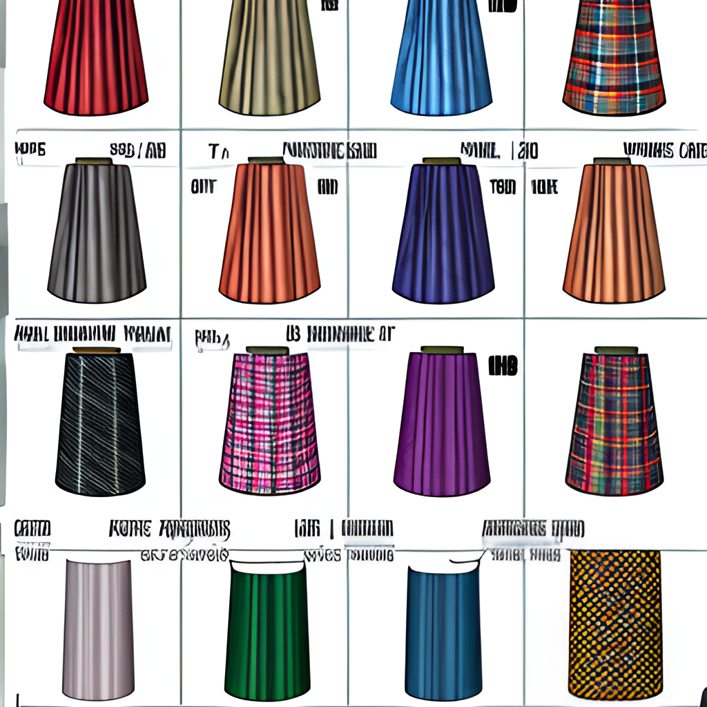

# Fabrics and Materials

Choosing the right fabric is crucial for the success of your sewing projects. Different fabrics behave differently, affect the ease of sewing, and impact the final appearance and durability of your project.

## Types of Fabrics:
1. **Cotton:** Versatile and easy to sew, ideal for beginners. Used in everything from clothing to quilting.
2. **Linen:** Known for its strength and coolness, excellent for summer wear.
3. **Silk:** Luxurious and slippery, challenging to sew but beautiful for formal garments.
4. **Wool:** Warm and comes in various weights; more challenging to sew but excellent for outerwear.
5. **Synthetics (Polyester, Nylon):** Generally easy to care for, not breathable but durable, used in a variety of applications from activewear to upholstery.

## Essential Sewing Materials:
- **Thread:** Quality thread in the right color and material enhances the appearance and longevity of your projects.
- **Scissors:** A sharp, high-quality pair of fabric scissors makes cutting fabrics easier and more precise.
- **Measuring Tools:** Tape measures and rulers are essential for measuring fabric and ensuring accurate cuts.
- **Pins and Needles:** Various sizes and types for different fabrics and thicknesses.
- **Marking Tools:** Fabric markers and tailor's chalk help in marking measurements and pattern placements on the fabric.

## Choosing the Right Fabric:
- Consider the project type: Durability, drape, and comfort are key factors.
- Pre-wash fabric to prevent shrinkage after sewing.
- Always align the fabric grain correctly before cutting to ensure the best fit and hang of the garment.

## Care Tips:
- Follow washing and drying instructions specific to each type of fabric to avoid damage.
- Store fabrics properly to prevent fading and moisture damage.

Understanding these materials and their properties will allow you to choose the best for your sewing projects and handle them correctly.
