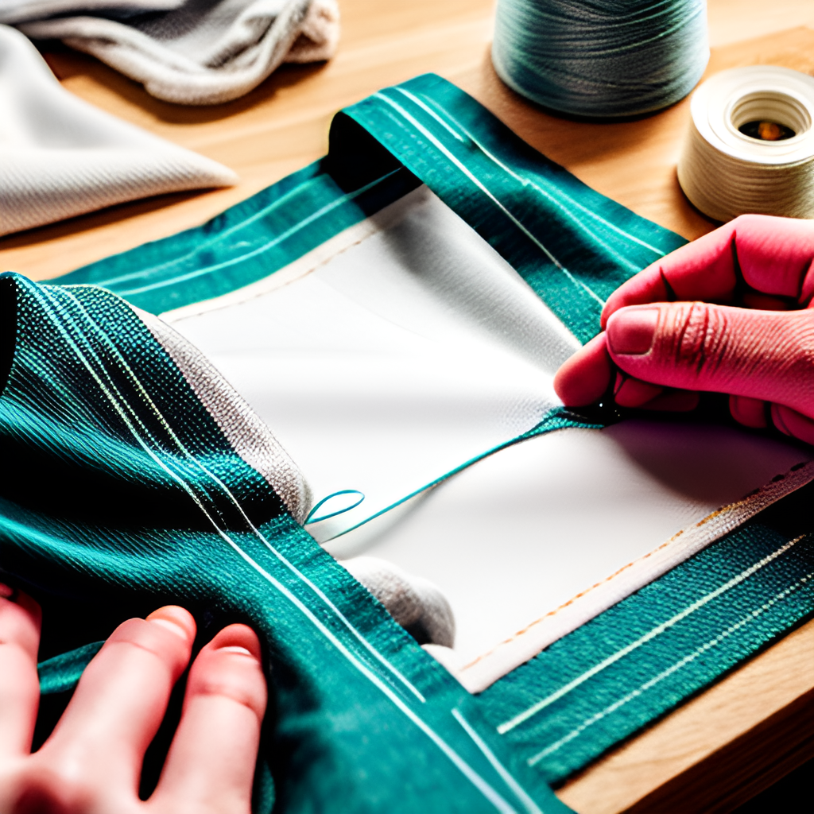

# Basic Sewing Techniques

Mastering basic sewing techniques is essential for anyone looking to create durable, professional-looking projects. This chapter covers the foundational skills needed for most sewing tasks.

## Straight Stitching:
- **Purpose:** The most common type of stitch for constructing garments.
- **Technique:** Set your machine to a straight stitch. Adjust the stitch length according to the fabric type—shorter stitches for finer fabrics and longer for thicker materials.
- **Tips:** Always backstitch at the beginning and end of a seam to secure the stitches.

## Zigzag Stitching:
- **Purpose:** Used for finishing raw edges and sewing stretch fabrics.
- **Technique:** Select the zigzag stitch on your machine. Adjust the stitch width and length. The wider and shorter the stitch, the more stretch it will have.
- **Tips:** Ideal for preventing fraying on fabric edges and for decorative purposes.

## Seam Finishes:
1. **Pinked Seams:** Use pinking shears to cut fabric edges, creating a zigzag pattern that resists fraying.
2. **Serged Seams:** If you have access to a serger, use it to trim and encase raw edges, providing a clean and stretch-resistant finish.
3. **French Seams:** Enclose the raw edges within the seam itself, ideal for sheer or delicate fabrics to give a neat finish.

## Practice Exercise:
- **Exercise 1:** Sew a simple cotton tote bag using straight stitches. Focus on even seam allowances and straight sewing.
- **Exercise 2:** Finish the inside edges of the tote bag with zigzag stitches or by creating French seams, depending on your machine's capabilities.

Mastering these basic techniques will enhance the durability and appearance of your sewing projects, preparing you for more advanced sewing tasks.
