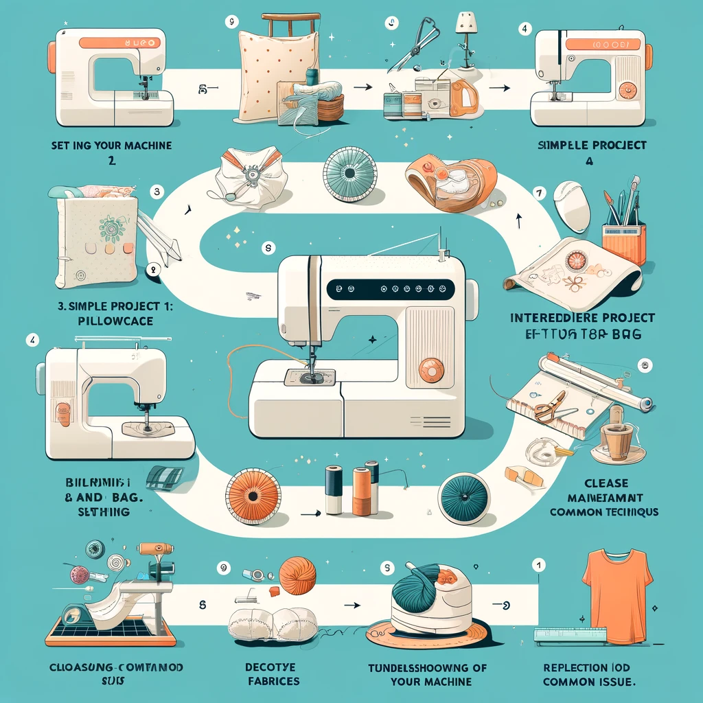

# About this guide
This sewing guideline is designed to systematically and comprehensively introduce you to the world of sewing using a modern sewing machine. Starting with the **Basics chapter**, you'll familiarize yourself with the crucial components and settings of your sewing machine, understand various fabric types, learn essential sewing techniques, grasp how to read and interpret patterns, and observe key safety measures while sewing. The guide provides step-by-step instructions to ensure you gain a solid foundation in handling your sewing machine confidently.

Moving to the **Learning Pathway**, the guide offers a structured sequence of exercises that incrementally build your sewing skills. From setting up your machine for the first use to completing simple projects like a pillowcase and a tote bag, advancing to more complex projects like a basic skirt, and mastering advanced techniques such as installing zippers and making alterations. Each project is crafted to enhance your understanding and skills, culminating in a comprehensive set of capabilities that empower you to undertake a variety of sewing projects with creativity and precision. This structured approach ensures a rewarding learning experience, paving the way for you to explore sewing in more creative and advanced ways.

# About lernOS

lernOS is a method of self-organisation for people living and working in the 21st century. To be successful today, you have to constantly learn, organise and develop yourself. Nobody else is responsible for this process. You have to take care of it yourself (self-directed, lifelong learning).

lernOS guides are licensed under [Creative Commons Attribution 4.0 International](https://creativecommons.org/licenses/by/4.0/deed.de) (CC BY 4.0): 

**You may:**

- **Share** - reproduce and redistribute the material in any format or medium.
- **Edit** - remix, modify and build upon the material for any purpose, even commercially.

**Under the following conditions:**

- **Attribution** - You must give appropriate credit, include a link to the licence and indicate if changes have been made. This attribution may be given in any reasonable manner, but not in a way that suggests the licensor is endorsing you or your use.
- **No other restrictions** - You may not use any additional terms or technical procedures that legally prohibit others from doing anything that the licence permits.
